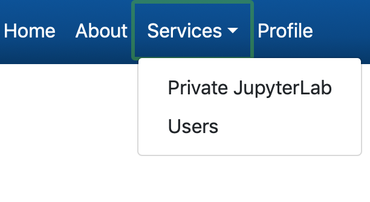
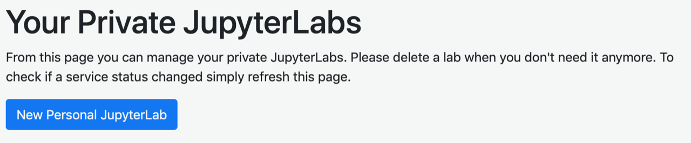
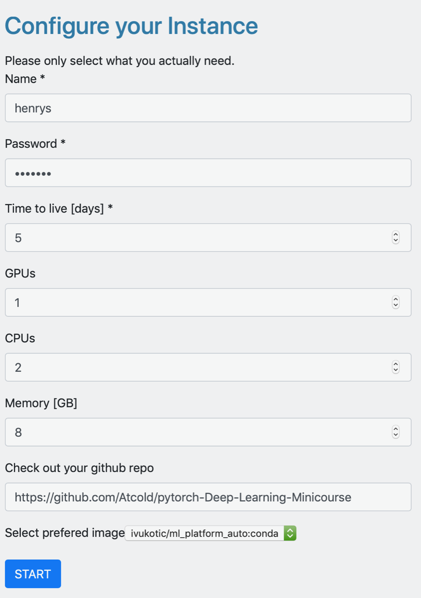
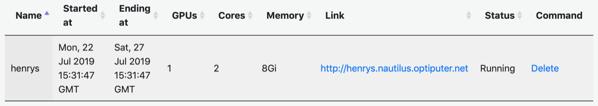

Title: Platform Setup Instructions
date: 2019-07-22 13:10
slug: platform-2019.html 
Authors: Savannah Thais 
Summary: Instructions for setting up the remote CoDaS platform with conda image
Template: page

# Remote CoDaS Platform Setup

First, login to the [platform](https://ml-front.nautilus.optiputer.net) using Globus with your CERN or university credntials.

Using the bar at the top of the screen select Services -> “Private JupyterLab”  

Then select "New Personal Lab"  

Fill out the form with appropriate settings to configure your lab

  * **Name:** this needs to be unique for each instance so use something with e.g. your actual name  
  * **Password:** set your own password  
  * **Time to live:** 5 days is fine  
  * **GPUs:** 1 is fine  
  * **CPUs:** 2  
  * **Memory:** leave at 8  
  * **Check out your github repo:** Either [`https://github.com/Atcold/pytorch-Deep-Learning-Minicourse.git`](https://github.com/Atcold/pytorch-Deep-Learning-Minicourse) or [`https://github.com/jpivarski/2019-07-23-codas-hep.git`](https://github.com/jpivarski/2019-07-23-codas-hep). You can get the other one with a `git clone` later.
  * **Select preferred image:** this must be set to the **conda** image  

Click start. It will likely take a few minutes to setup; when it is running it will appear in your list of labs

Launch the lab by clicking on the link and entering your password from the setup step. You know have a CoDaS-HEP environment when many useful packages already installed. You can add additional packages to this environment or create an entirely new one if desired.

The repositories have recommended environments in files. To add these:

1. Download the repository
2. Open a terminal in jupyterlab
3. Change to the directory you just downloaded
4. Run `conda env create -f environment.yml`

Now you should have a kernel choice with the correct repository.
